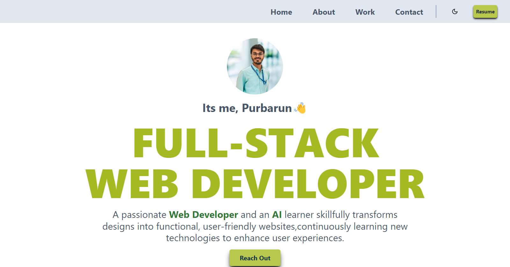
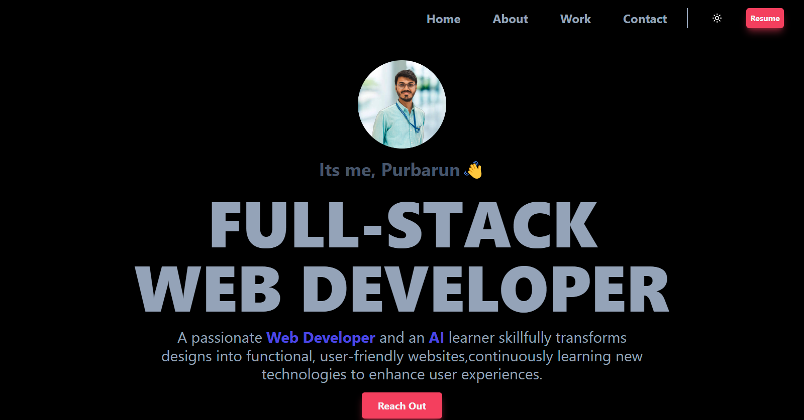

Creating a beautiful README file for your React.js portfolio website using Tailwind CSS involves providing clear and concise information along with visually appealing elements:

---

# [My Portfolio]

## Description
A stunning portfolio website showcasing my projects and skills, built using React.js and styled with Tailwind CSS.

## Table of Contents
- [Demo](#demo)
- [Technologies Used](#technologies-used)
- [Features](#features)
- [Setup Instructions](#setup-instructions)
- [Usage](#usage)
- [Contributing](#contributing)
- [License](#license)

## Demo

## Technologies Used
- React.js
- Tailwind CSS

## Features
- **Responsive Design:** Ensure your website looks great on various devices.
- **Project Showcase:** Highlight your projects with descriptions, images, and links.
- **Skills Section:** Display your skills using icons or progress bars.
- **Contact Information:** Provide ways for visitors to reach out to you.

## Setup Instructions
1. Clone the repository: `git clone https://github.com/username/NewPortfolio.git`
2. Navigate to the project directory: `cd NewPortfolio`
3. Install dependencies: `npm install`
4. Start the development server: `npm run dev`
5. Open your browser and visit `http://localhost:5173` to view the website.

## Usage
Provide instructions or examples on how users can navigate and interact with your website effectively.

## Contributing
1. Fork the repository.
2. Create a new branch (`git checkout -b feature-name`).
3. Make your changes and commit them (`git commit -am 'Add new feature'`).
4. Push to the branch (`git push origin feature-name`).
5. Create a new Pull Request.

## License
Include information about the license under which your project is distributed.

---

Feel free to customize the content and styling of the README file according to your preferences and specific details about your portfolio website. Including actual code snippets or terminal commands will also be helpful for users who want to use or contribute to your project.
